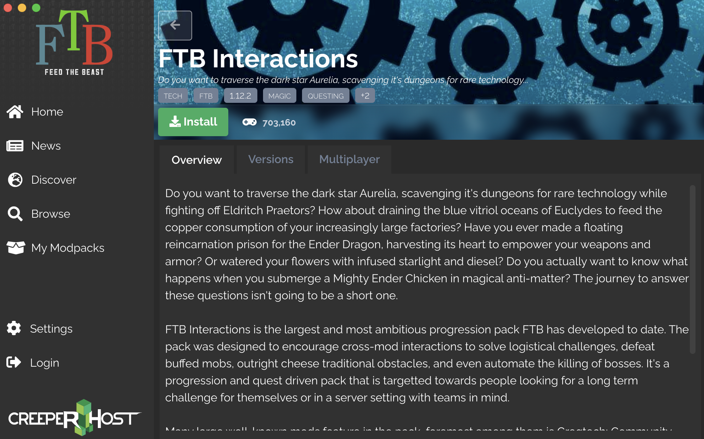

# mcforge

**Minecraft** starter project for a Minecraft Forge mod server.

<!-- TOC -->

- [mcforge](#mcforge)
- [Prerequisities](#prerequisities)
- [Install FTB Mod](#install-ftb-mod)
- [Download Minecraft and Forge servers](#download-minecraft-and-forge-servers)
- [Create your Minecraft world](#create-your-minecraft-world)
- [Install your Forge server](#install-your-forge-server)
- [Install your FTB mod server](#install-your-ftb-mod-server)
- [Configure your Minecraft server](#configure-your-minecraft-server)
- [Run FTB mod server](#run-ftb-mod-server)
- [Header](#header)

<!-- /TOC -->

# Prerequisities

* Java SDK 8+
* [FTB Launcher 0.1.0.719+](https://www.feed-the-beast.com)
* [MCVersions.net - Minecraft Versions Download List](https://mcversions.net)
* [Downloads for Minecraft Forge](https://files.minecraftforge.net/net/minecraftforge/forge)

# Install FTB Mod

After installing **Feed The Beast (FTB) Launcher**, run the app. Click `Browse` >> Search for a mod, in our case, type `Interactions` in the textbox >> Click `... More` on the `FTB Interactions` icon.



Take note of the `<version>` tag, e.g. `1.12.2`, as this is the Minecraft server version that we will use with this mod. You may have to download a different Minecraft server version for your mod.

Click `Versions` >> Click `Download Server` >> We will use `Linux` for our server. You may choose a different OS for your server.

Save the `<server_install>` file under a new `<minecraft>` folder, in our case we named the folder `mc.1.12.2-ftb-interactions.2.0.9`.

# Download Minecraft and Forge servers

Make sure you download the stable release of the correct `<version>` of a [Minecraft server](https://mcversions.net). Download and save the `<mc_version>.jar` file, e.g `minecraft_server.1.12.2.jar`, into your `<minecraft>` folder.

Next, download the stable release of the correct `<version>` of a [Minecraft Forge](https://files.minecraftforge.net/net/minecraftforge/forge). Download and save the `<forge_version>.jar` file, e.g `forge-1.12.2-14.23.5.2855-installer.jar`, into your `<minecraft>` folder.

# Create your Minecraft world

Create a new subfolder `data` under your `<minecraft>` folder. Then enter the following command:

```sh
cd data
echo "eula=true" > eula.txt
java -Xms1024M -Xmx2048M -DIReallyKnowWhatIAmDoingISwear -jar ../<mc_version>.jar nogui
``` 

```sh
[20:14:34] [Server thread/INFO]: Starting minecraft server version 1.12.2
[20:14:34] [Server thread/INFO]: Loading properties
[20:14:34] [Server thread/INFO]: Default game type: SURVIVAL
[20:14:34] [Server thread/INFO]: Generating keypair
[20:14:34] [Server thread/INFO]: Starting Minecraft server on *:25565
[20:14:34] [Server thread/INFO]: Using epoll channel type
[20:14:34] [Server thread/INFO]: Preparing level "world"
[20:14:35] [Server thread/INFO]: Loaded 488 advancements
[20:14:35] [Server thread/INFO]: Preparing start region for level 0
[20:14:36] [Server thread/INFO]: Preparing spawn area: 7%
[20:14:37] [Server thread/INFO]: Preparing spawn area: 13%
[20:14:38] [Server thread/INFO]: Preparing spawn area: 20%
[20:14:39] [Server thread/INFO]: Preparing spawn area: 28%
[20:14:40] [Server thread/INFO]: Preparing spawn area: 37%
[20:14:41] [Server thread/INFO]: Preparing spawn area: 46%
[20:14:42] [Server thread/INFO]: Preparing spawn area: 56%
[20:14:43] [Server thread/INFO]: Preparing spawn area: 66%
[20:14:44] [Server thread/INFO]: Preparing spawn area: 75%
[20:14:45] [Server thread/INFO]: Preparing spawn area: 85%
[20:14:46] [Server thread/INFO]: Preparing spawn area: 93%
[20:14:47] [Server thread/INFO]: Done (12.748s)! For help, type "help" or "?"
```

Press `Ctrl+C` to stop the server, you should be able to see some new files in your `data` folder. The most important file is `server.properties`, which we will configure later.

# Install your Forge server

Next, install your Forge server by running the following command:

```sh
java -jar ../<forge_version>.jar --installServer
```

```
JVM info: IcedTea - 1.8.0_275 - 25.275-b01
java.net.preferIPv4Stack=true
Found java version 1.8.0_275
Target Directory: .
Extracting main jar:
  Extracted successfully
Considering minecraft server jar
  Downloading library from https://launcher.mojang.com/v1/objects/886945bfb2b978778c3a0288fd7fab09d315b25f/server.jar
    Download completed: Checksum validated.
Downloading libraries
Considering library net.minecraftforge:forge:1.12.2-14.23.5.2855
  Extracting library from /maven/net/minecraftforge/forge/1.12.2-14.23.5.2855/forge-1.12.2-14.23.5.2855.jar
    Extraction completed: Checksum validated.
Considering library org.ow2.asm:asm-debug-all:5.2
  Downloading library from https://files.minecraftforge.net/maven/org/ow2/asm/asm-debug-all/5.2/asm-debug-all-5.2.jar
Following redirect: https://maven.minecraftforge.net/org/ow2/asm/asm-debug-all/5.2/asm-debug-all-5.2.jar
    Download completed: Checksum validated.
Considering library net.minecraft:launchwrapper:1.12
  Downloading library from https://libraries.minecraft.net/net/minecraft/launchwrapper/1.12/launchwrapper-1.12.jar
    Download completed: Checksum validated.
Considering library org.jline:jline:3.5.1
  Downloading library from https://files.minecraftforge.net/maven/org/jline/jline/3.5.1/jline-3.5.1.jar
Following redirect: https://maven.minecraftforge.net/org/jline/jline/3.5.1/jline-3.5.1.jar
    Download completed: Checksum validated.
Considering library com.typesafe.akka:akka-actor_2.11:2.3.3
  Downloading library from https://files.minecraftforge.net/maven/com/typesafe/akka/akka-actor_2.11/2.3.3/akka-actor_2.11-2.3.3.jar
Following redirect: https://maven.minecraftforge.net/com/typesafe/akka/akka-actor_2.11/2.3.3/akka-actor_2.11-2.3.3.jar
    Download completed: Checksum validated.
Considering library com.typesafe:config:1.2.1
  Downloading library from https://files.minecraftforge.net/maven/com/typesafe/config/1.2.1/config-1.2.1.jar
Following redirect: https://maven.minecraftforge.net/com/typesafe/config/1.2.1/config-1.2.1.jar
    Download completed: Checksum validated.
Considering library org.scala-lang:scala-actors-migration_2.11:1.1.0
  Downloading library from https://files.minecraftforge.net/maven/org/scala-lang/scala-actors-migration_2.11/1.1.0/scala-actors-migration_2.11-1.1.0.jar
Following redirect: https://maven.minecraftforge.net/org/scala-lang/scala-actors-migration_2.11/1.1.0/scala-actors-migration_2.11-1.1.0.jar
    Download completed: Checksum validated.
Considering library org.scala-lang:scala-compiler:2.11.1
  Downloading library from https://files.minecraftforge.net/maven/org/scala-lang/scala-compiler/2.11.1/scala-compiler-2.11.1.jar
Following redirect: https://maven.minecraftforge.net/org/scala-lang/scala-compiler/2.11.1/scala-compiler-2.11.1.jar
    Download completed: Checksum validated.
Considering library org.scala-lang.plugins:scala-continuations-library_2.11:1.0.2_mc
  Downloading library from https://files.minecraftforge.net/maven/org/scala-lang/plugins/scala-continuations-library_2.11/1.0.2_mc/scala-continuations-library_2.11-1.0.2_mc.jar
Following redirect: https://maven.minecraftforge.net/org/scala-lang/plugins/scala-continuations-library_2.11/1.0.2_mc/scala-continuations-library_2.11-1.0.2_mc.jar
    Download completed: Checksum validated.
Considering library org.scala-lang.plugins:scala-continuations-plugin_2.11.1:1.0.2_mc
  Downloading library from https://files.minecraftforge.net/maven/org/scala-lang/plugins/scala-continuations-plugin_2.11.1/1.0.2_mc/scala-continuations-plugin_2.11.1-1.0.2_mc.jar
Following redirect: https://maven.minecraftforge.net/org/scala-lang/plugins/scala-continuations-plugin_2.11.1/1.0.2_mc/scala-continuations-plugin_2.11.1-1.0.2_mc.jar
    Download completed: Checksum validated.
Considering library org.scala-lang:scala-library:2.11.1
  Downloading library from https://files.minecraftforge.net/maven/org/scala-lang/scala-library/2.11.1/scala-library-2.11.1.jar
Following redirect: https://maven.minecraftforge.net/org/scala-lang/scala-library/2.11.1/scala-library-2.11.1.jar
    Download completed: Checksum validated.
Considering library org.scala-lang:scala-parser-combinators_2.11:1.0.1
  Downloading library from https://files.minecraftforge.net/maven/org/scala-lang/scala-parser-combinators_2.11/1.0.1/scala-parser-combinators_2.11-1.0.1.jar
Following redirect: https://maven.minecraftforge.net/org/scala-lang/scala-parser-combinators_2.11/1.0.1/scala-parser-combinators_2.11-1.0.1.jar
    Download completed: Checksum validated.
Considering library org.scala-lang:scala-reflect:2.11.1
  Downloading library from https://files.minecraftforge.net/maven/org/scala-lang/scala-reflect/2.11.1/scala-reflect-2.11.1.jar
Following redirect: https://maven.minecraftforge.net/org/scala-lang/scala-reflect/2.11.1/scala-reflect-2.11.1.jar
    Download completed: Checksum validated.
Considering library org.scala-lang:scala-swing_2.11:1.0.1
  Downloading library from https://files.minecraftforge.net/maven/org/scala-lang/scala-swing_2.11/1.0.1/scala-swing_2.11-1.0.1.jar
Following redirect: https://maven.minecraftforge.net/org/scala-lang/scala-swing_2.11/1.0.1/scala-swing_2.11-1.0.1.jar
    Download completed: Checksum validated.
Considering library org.scala-lang:scala-xml_2.11:1.0.2
  Downloading library from https://files.minecraftforge.net/maven/org/scala-lang/scala-xml_2.11/1.0.2/scala-xml_2.11-1.0.2.jar
Following redirect: https://maven.minecraftforge.net/org/scala-lang/scala-xml_2.11/1.0.2/scala-xml_2.11-1.0.2.jar
    Download completed: Checksum validated.
Considering library lzma:lzma:0.0.1
  Downloading library from https://libraries.minecraft.net/lzma/lzma/0.0.1/lzma-0.0.1.jar
    Download completed: Checksum validated.
Considering library java3d:vecmath:1.5.2
  Downloading library from https://libraries.minecraft.net/java3d/vecmath/1.5.2/vecmath-1.5.2.jar
    Download completed: Checksum validated.
Considering library net.sf.trove4j:trove4j:3.0.3
  Downloading library from https://libraries.minecraft.net/net/sf/trove4j/trove4j/3.0.3/trove4j-3.0.3.jar
    Download completed: Checksum validated.
Considering library org.apache.maven:maven-artifact:3.5.3
  Downloading library from https://files.minecraftforge.net/maven/org/apache/maven/maven-artifact/3.5.3/maven-artifact-3.5.3.jar
Following redirect: https://maven.minecraftforge.net/org/apache/maven/maven-artifact/3.5.3/maven-artifact-3.5.3.jar
    Download completed: Checksum validated.
Considering library net.sf.jopt-simple:jopt-simple:5.0.3
  Downloading library from https://libraries.minecraft.net/net/sf/jopt-simple/jopt-simple/5.0.3/jopt-simple-5.0.3.jar
    Download completed: Checksum validated.
Building Processors
The server installed successfully, you should now be able to run the file forge
You can delete this installer file now if you wish
```

# Install your FTB mod server

Next, install your FTB mod server by running the following command:

```sh
chmod +x ../<server_install>
../<server_install>
```

```
Where would you like to install the server? [current directory]
.
Path . already exists - still want to install? (y/n) [y]
y
Continuing will install FTB Interactions version 2.0.9. Do you wish to continue? (y/n) [y]
y
```

# Configure your Minecraft server

A `server.properties` file was created in `data` folder, when you installed your <mc_version>. Open this in a text editor, and change the following lines:

```
allow-flight=false
allow-nether=true
broadcast-console-to-ops=true
broadcast-rcon-to-ops=true
debug=false
difficulty=easy
discoverability=unlisted
displayname=Fill this in if you have set the server to public\!
enable-command-block=false
enable-jmx-monitoring=false
enable-query=false
enable-rcon=false
enable-status=true
enforce-whitelist=false
entity-broadcast-range-percentage=100
force-gamemode=true
function-permission-level=2
gamemode=survival
generate-structures=true
generator-settings=
hardcore=false
level-name=world
level-seed=
level-type=voidworld
max-build-height=256
max-players=20
max-tick-time=60000
max-world-size=29999984
motd=Minecraft Adventures
network-compression-threshold=256
online-mode=false
op-permission-level=4
player-idle-timeout=0
prevent-proxy-connections=false
pvp=false
query.port=25565
rate-limit=0
rcon.password=
rcon.port=25575
resource-pack=
resource-pack-sha1=
server-ip=
server-port=25565
snooper-enabled=false
spawn-animals=true
spawn-monsters=true
spawn-npcs=true
spawn-protection=16
sync-chunk-writes=true
text-filtering-config=
use-native-transport=true
view-distance=10
white-list=false
```

Set `level-type` to `voidworld` if the starting world is in a void, otherwise set to `default`.

# Run FTB mod server

```sh
java -Xms1024M -Xmx2048M -DIReallyKnowWhatIAmDoingISwear -jar <forge_version>.jar nogui
```

# Header

<details>
  <summary>Click here to header.</summary><br>
</details>
